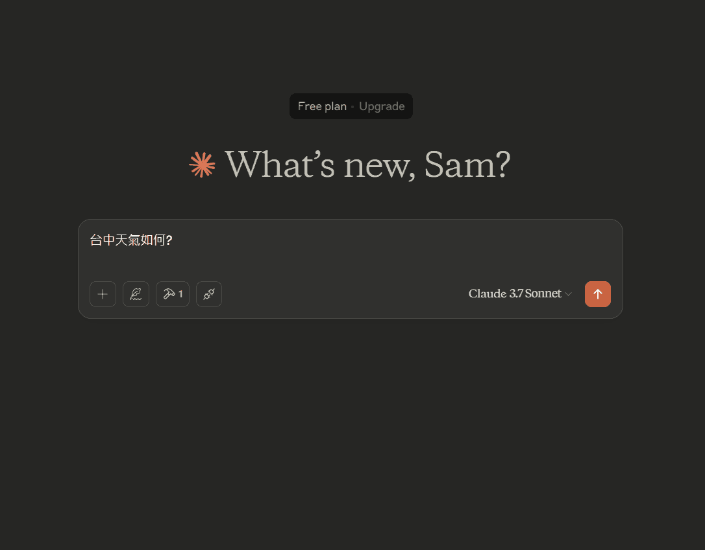
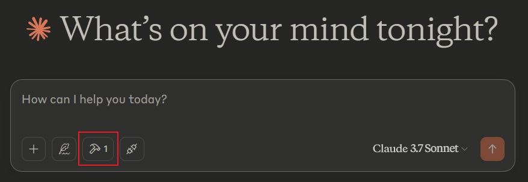
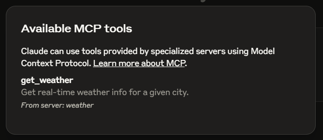
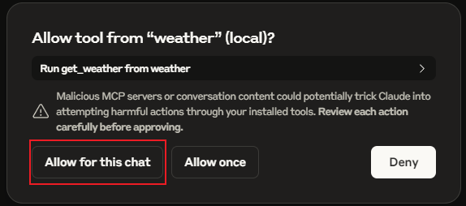

# ClaudeLocalMCP.ts
自己為 Claude 寫本地端 MCP Server 很簡單，有手就行😁
完整流程 Demo 的 gif 圖檔  


## Weather MCP Server
這是用來給 Claude 查詢指定地區的天氣資訊

### 申請天氣 API 服務
我去申請 https://openweathermap.org/ 的免費服務
請去註冊並取得 API 金鑰 (API Key)

### 在 .env 填入金鑰
```shell
OPENWEATHERMAP_API_KEY=你的實際API金鑰貼在這裡
```
記得在 dist 內放上 .env 檔案來提供 API金鑰

### 安裝 Claude 桌面版
https://claude.ai/download

### 開啟 Claude 開發模式
右上角 File => Settings
開啟 Developer 模式

### 設定 MCP Server 給 Claude 使用
Windows 用戶請  
開啟目錄 `C:\Users\使用者名稱\AppData\Roaming\Claude`  
檔案名稱 `claude_desktop_config.json`
```json
{
    "mcpServers": {
        "weather": {
            "command": "node",
            "args": [
                "D:\\github\\ClaudeLocalMCP.ts\\dist\\index.js",
                "envPath=D:\\github\\ClaudeLocalMCP.ts\\.env"
            ]
        }
    }
}
```
envPath 是指定 .env 的路徑

確認一下 MCP 是否正常開啟  

檢視一下 MCP 名稱  

詢問時要指定地區，如: 台中天氣如何?  
Claude 會要你確認(Allow for this chat)是否可以執行 MCP 服務


### 查詢 MCP Server 執行 log
Windows 用戶請  
開啟目錄 `C:\Users\使用者名稱\AppData\Roaming\Claude\logs`  